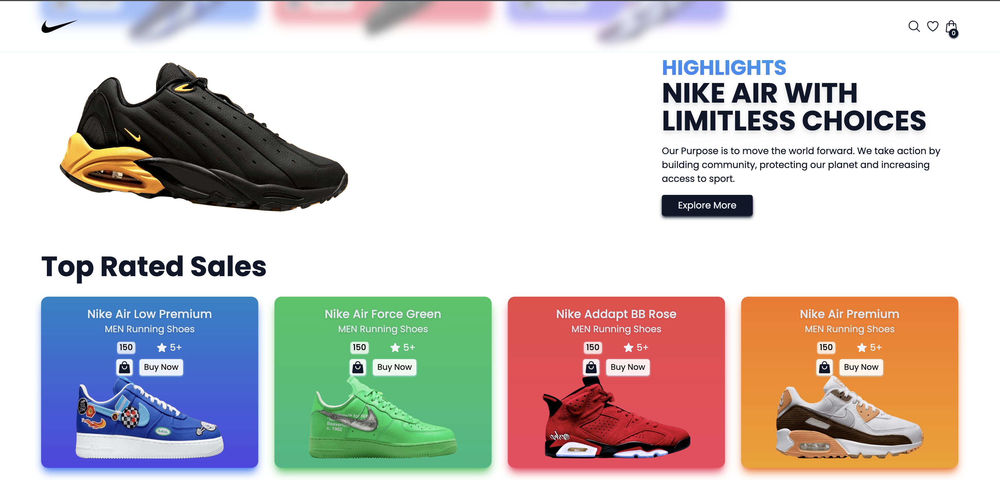
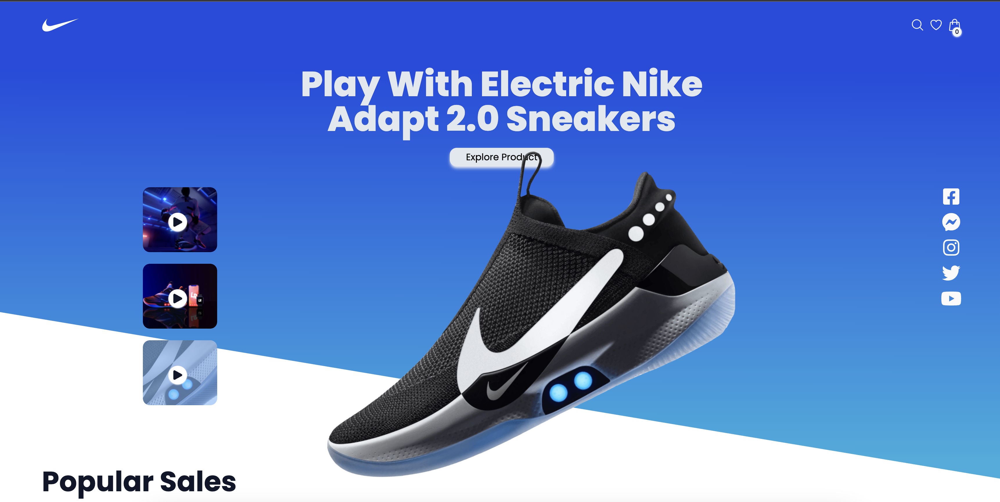
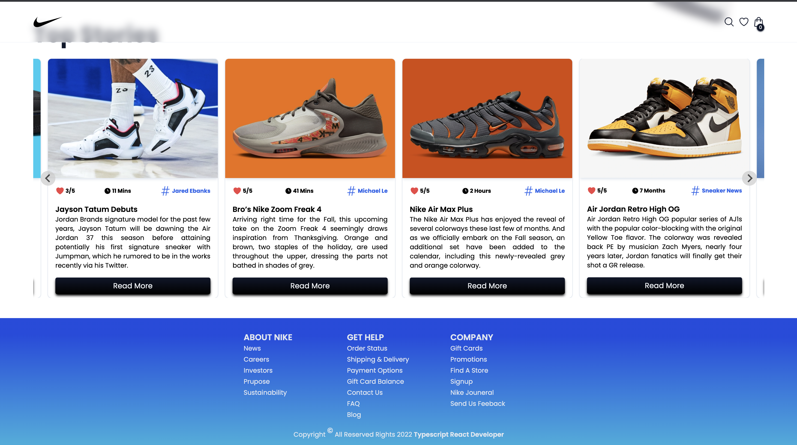
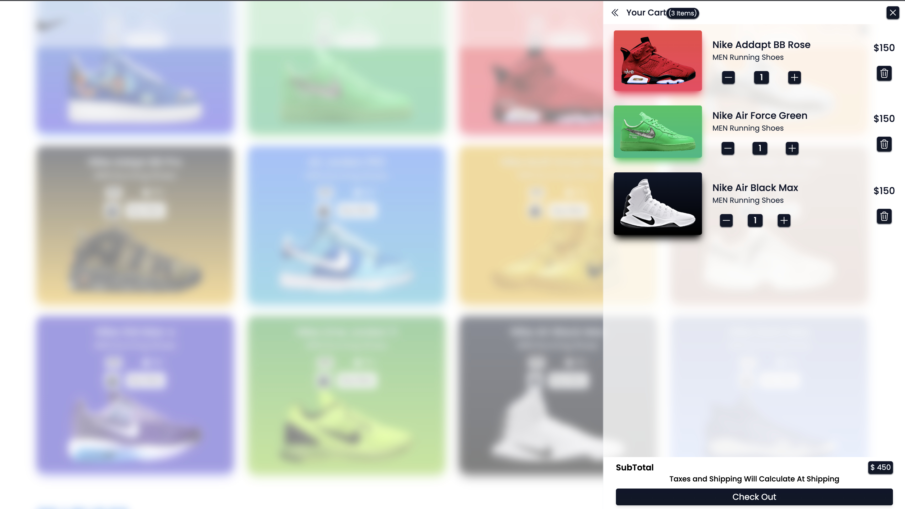
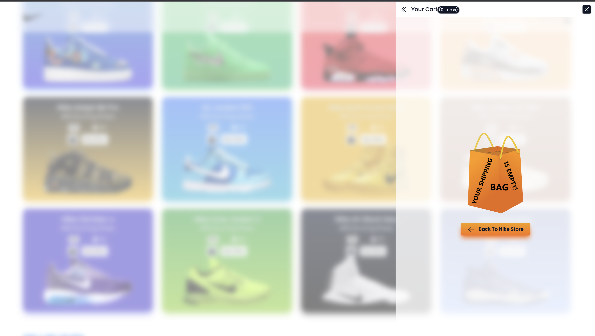
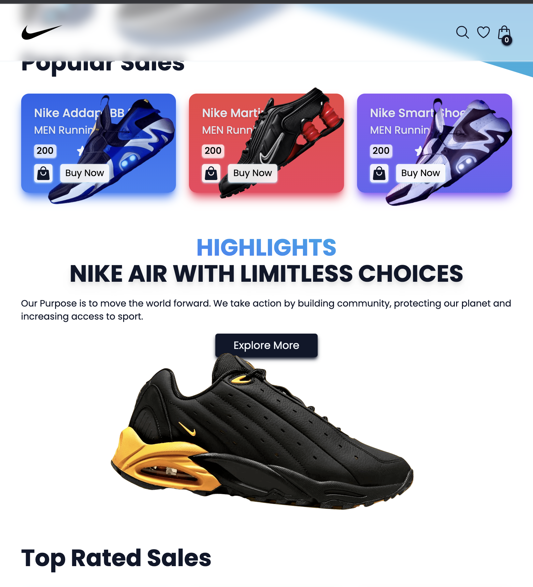

# with Tailwind Nike Ecommerse project Typescript and Redux Toolkit

This project was bootstrapped with [Create React App](https://github.com/facebook/create-react-app).

# What I Practice

1. react-touch-carousel component –tailwind için line-clamp
2. For add cart notifications react-hot-toast
3. Lots of tailwind 🙂

# Deploy

🌏 ![demo] :(https://earnest-meerkat-ec8514.netlify.app/)

💻 Screen shot 💻

